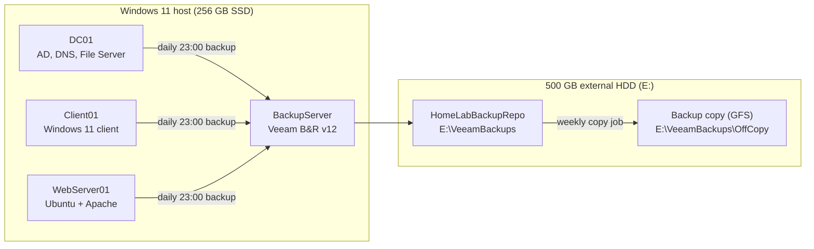

# Enterprise-Backup-Disaster-Recovery-Lab
# Veeam Backup & Replication Home Lab: Full Restore, Ransomware Simulation and Disaster Recovery Planning

**Author:** Clinton Kehinde
**Platform:** VMware Workstation Player and Veeam Backup & Replication Community Edition v12
**Status:** Completed and verified

> *A backup you have never tested is not a backup. It is hope.*

---

## Project Overview

I built a small virtual company network on my own computer, protected it with Veeam Backup & Replication, and then deliberately broke it to prove I could recover it.

Backups are one of the most overlooked parts of IT. They get set up once, run quietly in the background, and nobody looks at them until something goes wrong. That is often the moment a company finds out its backups have been failing silently for weeks. I did not want to say I understood backup and disaster recovery just because I had watched tutorials, so I set myself one rule for this project:

**A backup is only valuable if it can actually be restored.**

Instead of stopping once the backup jobs were green, I created three realistic failure scenarios and recovered from each one:

1. **Hardware failure:** I deleted a Domain Controller and its virtual disk, then restored the whole server.
2. **Accidental deletion:** I deleted a shared folder, emptied the Recycle Bin, then restored just that folder.
3. **Ransomware attack:** I simulated one (without real malware), deleted the Windows Shadow Copies, and recovered every file from an isolated backup.

I timed every recovery, wrote down every problem I hit, and finished by writing a Disaster Recovery (DR) plan for the lab.

> [!NOTE]
> I did **not** use real ransomware at any point. The attack was simulated by renaming files and deleting Shadow Copies inside an isolated home lab. Please do not run the simulation commands in this repository on any system you do not own and are not prepared to rebuild.

---

## Objectives

- Design a backup environment that follows real-world best practices (separate backup server, separate physical storage, a second backup copy).
- Install and configure Veeam Backup & Replication Community Edition.
- Create application-aware backup jobs, a backup copy job and a GFS retention policy.
- Prove that backups work using restore tests and SureBackup verification.
- Perform a full VM restore and a file-level restore, and measure how long each takes.
- Simulate a ransomware attack and recover from it.
- Test whether my backup repository could be reached from another machine (backup isolation).
- Write and document a Disaster Recovery plan with recovery objectives, incident severity levels, and a recovery procedure.
- Record every test and every problem, with root causes and fixes.

---

## Results at a Glance

| Metric | Target / Setting | Measured Result |
| ------ | ---------------- | --------------- |
| Recovery Point Objective (RPO) | 24 hours (daily backups) | Maximum possible data loss in the ransomware test was under 24 hours; actual data loss was zero |
| Recovery Time Objective (RTO) | 2 hours for any production server | **22 minutes** for a full Domain Controller restore |
| File-level recovery time | n/a | **4 to 8 minutes** |
| Recovery and integrity tests completed | n/a | **6 of 6 passed** |
| Data loss during testing | n/a | **Zero** |
| Ransomware recovery | n/a | **Successful** (47 files across 8 shared folders) |
| Backup isolation | Repository not reachable from other machines | **Verified** |

---

## Technologies Used

| Technology | How I used it |
| ---------- | ------------- |
| Veeam Backup & Replication v12 (Community Edition) | Backup, restore, backup copy and SureBackup verification |
| VMware Workstation Player | Hosting the lab virtual machines |
| Windows Server 2022 | Domain Controller / DNS / file server (DC01) and backup server (BackupServer) |
| Windows 11 | Domain-joined client workstation (Client01) and host machine |
| Ubuntu Server 22.04 | Apache web server (WebServer01) |
| Active Directory Domain Services and DNS | The core services I needed to protect and recover |
| Windows Volume Shadow Copy Service (VSS) | Application-consistent backups and the ransomware simulation |
| PowerShell and Command Prompt | Simulating the ransomware behaviour |
| SQL Server Express | Veeam's configuration database |

---

## Lab Environment

### Host machine

| Component | Specification |
| --------- | ------------- |
| CPU | Intel Core i5 (4 cores) |
| RAM | 8 GB DDR4 |
| Storage | 256 GB SSD (primary) + 500 GB external HDD (backup target) |
| Operating system | Windows 11 |
| Virtualisation | VMware Workstation Player |
| Backup software | Veeam Backup & Replication Community Edition v12 |

### Virtual machines

| VM | Role |
| -- | ---- |
| **DC01** | Windows Server 2022: Domain Controller, DNS server and file server |
| **Client01** | Windows 11: domain-joined client workstation |
| **WebServer01** | Ubuntu Server 22.04: Apache web server |
| **BackupServer** | Windows Server 2022: dedicated Veeam Backup & Replication server |

**Network:** VMware NAT (VMnet8)


 Insert screenshot showing: The VMware Workstation Player library with all four virtual machines (DC01, Client01, WebServer01 and BackupServer) listed.

---

## Architecture



The key design decisions, and the reasons behind them, are covered in [Lab Environment and Architecture](docs/01-lab-environment-and-architecture.md). The short version:

- Veeam runs on its **own dedicated VM**, not on the Domain Controller.
- Backups are stored on a **separate physical drive**, not on the SSD that holds the production VMs.
- The repository is **not shared over the network**, so another machine cannot browse to it and encrypt it.
- A **backup copy job** creates a second copy with weekly and monthly retention (GFS).

---

## Repository Structure

```text
veeam-backup-dr-homelab/
├── README.md
├── docs/
│   ├── 01-lab-environment-and-architecture.md
│   ├── 02-veeam-installation-and-configuration.md
│   ├── 03-running-and-verifying-backups.md
│   ├── 04-full-and-file-level-restores.md
│   ├── 05-ransomware-simulation-and-recovery.md
│   ├── 06-disaster-recovery-plan.md
│   ├── 07-backup-integrity-test-record.md
│   ├── 08-challenges-and-troubleshooting.md
│   └── 09-lessons-learned-and-portfolio-summary.md
└── images/
```

## Documentation Index

| # | Document | What it covers |
| - | -------- | -------------- |
| 1 | [Lab Environment and Architecture](docs/01-lab-environment-and-architecture.md) | Host, VMs, separate backup server, separate drive, the 3-2-1 rule |
| 2 | [Veeam Installation and Configuration](docs/02-veeam-installation-and-configuration.md) | Install, add the VMware host, repository, backup job, backup copy job, GFS |
| 3 | [Running and Verifying Backups](docs/03-running-and-verifying-backups.md) | First full backup, incremental backup, SureBackup |
| 4 | [Full and File-Level Restores](docs/04-full-and-file-level-restores.md) | Deleting and restoring DC01, restoring a deleted folder, RTO |
| 5 | [Ransomware Simulation and Recovery](docs/05-ransomware-simulation-and-recovery.md) | Simulated attack, Shadow Copy deletion, isolation test, recovery |
| 6 | [Disaster Recovery Plan](docs/06-disaster-recovery-plan.md) | RPO/RTO, severity levels, 7-phase procedure, priorities, schedule |
| 7 | [Backup Integrity Test Record](docs/07-backup-integrity-test-record.md) | The test log that proves the backups work |
| 8 | [Challenges and Troubleshooting](docs/08-challenges-and-troubleshooting.md) | Three problems, their root causes and fixes |
| 9 | [Lessons Learned and Portfolio Summary](docs/09-lessons-learned-and-portfolio-summary.md) | Security and production considerations, future improvements, conclusion |

---

## Prerequisites

If you want to build something similar, this is what I used:

- A Windows 11 PC with at least 8 GB of RAM (mine has exactly 8 GB, which is why I limited Veeam to two concurrent tasks)
- A second physical drive for backups (I used a 500 GB external USB hard drive)
- VMware Workstation Player
- Windows Server 2022, Windows 11 and Ubuntu Server 22.04 installation media
- A free Veeam account to download Veeam Backup & Replication Community Edition (the installer ISO is about 4 GB)
- Enough patience to wait for virtual machines to boot on limited hardware

---

## Security Considerations (Summary)

- **Separate backup server:** Veeam is not installed on the systems it protects.
- **Separate physical storage:** a failed or encrypted SSD cannot take the backups with it.
- **Repository isolation:** the repository is not shared over the network, and Windows Firewall blocks normal access to it.
- **Application-aware processing with administrator credentials:** needed to get a restorable Active Directory backup.
- **GFS retention:** weekly and monthly copies give me a chance to find a clean restore point if an attack goes unnoticed for a while.
- **Restore reasons are recorded** so there is an audit trail.

The full discussion, including what my lab does **not** do, is in [Lessons Learned and Portfolio Summary](docs/09-lessons-learned-and-portfolio-summary.md).

---

## Limitations of This Lab (Being Honest)

My home lab teaches the core principles of enterprise backup, but it is not a production environment:

- The backup copy job writes to a **second folder on the same external drive**, so it simulates an off-site copy rather than providing one.
- I did **not** enable backup encryption.
- I monitored jobs by checking the Veeam console manually; there is no automated alerting.
- There are no immutable or air-gapped backups.
- Everything runs on one physical computer.

These are listed again as future improvements in [document 9](docs/09-lessons-learned-and-portfolio-summary.md#future-improvements).

---

## Conclusion

This project was not really about learning Veeam. It was about building the mindset of an IT professional who understands that protecting systems is only half the job. The real responsibility is making sure those systems can be recovered quickly, safely and with minimal disruption when something goes wrong.

I planned, built, tested, broke, restored and documented an entire backup and disaster recovery environment, and I have the measured numbers to show it works.

**Start reading here:** [1. Lab Environment and Architecture →](docs/01-lab-environment-and-architecture.md)
